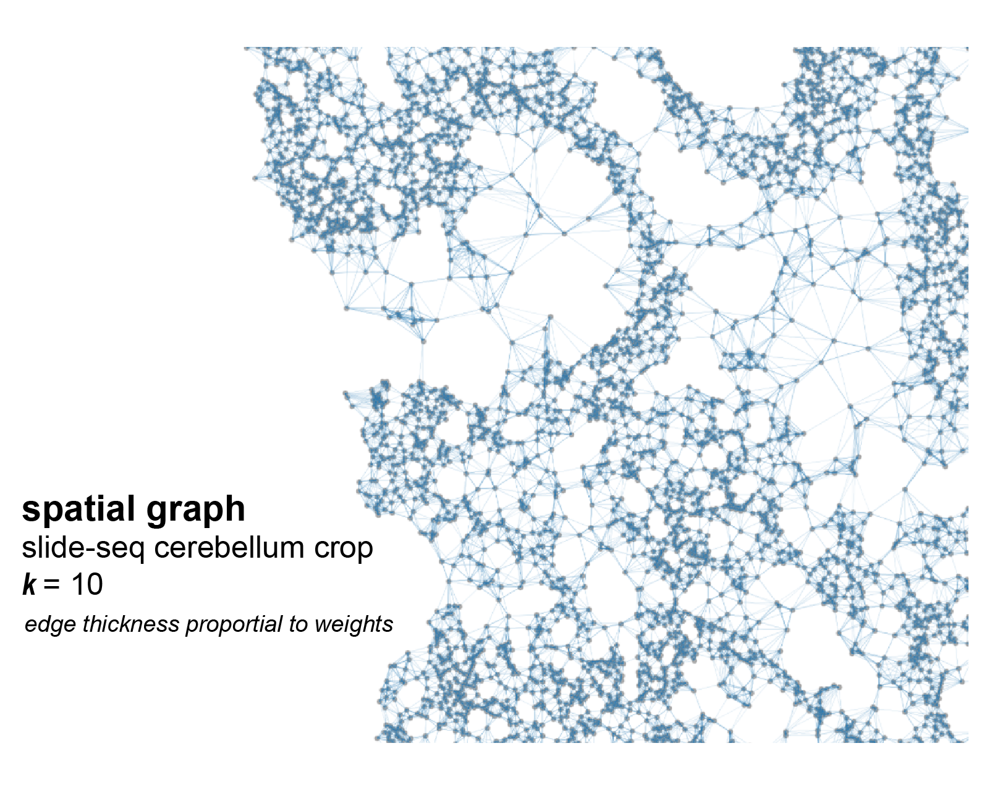
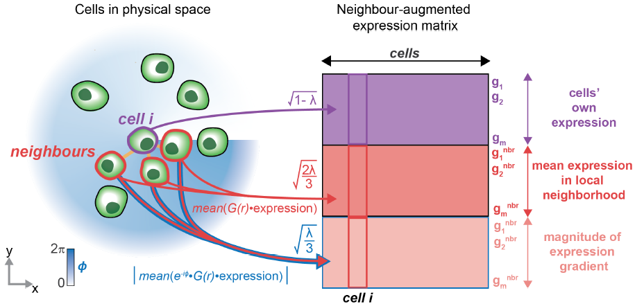

# <b> BANKSY:  Spatial Clustering Algorithm that Unifies Cell-Typing and Tissue Domain Segmentation (version 1.1.1) </b>

### *Vipul Singhal\*, Nigel Chou\*, Joseph Lee, Yifei Yue, Jinyue Liu, Wan Kee Chock, Li Lin, YunChing Chang, Erica Teo, Hwee Kuan Lee, Kok Hao Chen<sup>#</sup> and Shyam Prabhakar<sup>#</sup>* <br>

## <b> Overview  </b>

This repository contains the code base and examples for Building Aggregates with a Neighborhood Kernel and Spatial Yardstick developed for: `BANKSY: A Spatial Clustering Algorithm that Unifes Cell Typing and Tissue Domain Segmentation.` `BANKSY` is a method for clustering spatial transcriptomic data by augmenting the transcriptomic profile of each cell with an average of the transcriptomes of its spatial neighbors. 

By incorporating neighborhood information for clustering, BANKSY is able to:

1. **Improve cell-type assignment** in noisy data

2. Distinguish **subtly different cell-types** stratified by microenvironment

3. **Identify spatial zones** sharing the same microenvironment

BANKSY is applicable to a wide variety of spatial technologies (e.g. 10x Visium, Slide-seq, MERFISH) and scales well to large datasets. For more details on use-cases and methods, see the preprint. 

This Python version of BANKSY (compatible with `Scanpy`), we show how BANKSY can be used for task **1** (improving cell-type assignment) using Slide-seq and Slide-seq V2 mouse cerebellum datasets. 
The R version of BANKSY is available here (https://github.com/prabhakarlab/Banksy).

## <b> Prerequisites <a name="prereqs"></a>  </b>

### System requirements: <a name="sysreqs"></a>

Machine with at least 16 GB of RAM. `BANKSY` is extremely scalable and fast even on CPU for large datasets. 

### Software requirements: <a name="softreqs"></a>

This software requires the following packages and has been tested on the following versions:

1.	Python >= 3.8
2.	Scanpy >= 1.8.1
3. Anndata >= 0.7.1
4.	numpy >= 1.21
5.	scipy >= 1.6
6.	umap >= 0.5.1
7.	scikit-learn >= 0.24.2
8.	python-igraph >= 0.9
9. leidenalg 

#### (Optional) As alternatives to `leiden` clustering, we also support `mclust` and `louvain`. To use these clustering algorithms, you need these additional packages:

#### For mclust
- R == 4.2.3 
- r-mclust == 6.0.0 
- rpy2 >= 3.4.0

#### For louvain (via `sc.tl.louvain`)
- louvain

## <b> Getting Started <a name="getstart"></a> </b>

### Installation via Anaconda (recommended) <a name="install"></a>

To use ``Banksy_py``, we recommend setting up a ``conda`` environment and installing the prequisite packages, then cloning this repository.

      (base) $ conda create --name banksy
      (base) $ conda activate banksy
      (banksy) $ conda install -c conda-forge scanpy python-igraph leidenalg
      (banksy) $ git clone https://github.com/prabhakarlab/Banksy_py.git
      (banksy) $ cd Banksy_py

To run the examples presented in `juypter` notebooks, install the extensions for `juypter`.

      (banksy) $ conda install -c conda-forge jupyter

Try out `BANKSY` by running the examples in the provide ipython notebooks: [`slideseqv1_analysis.ipynb`](./slideseqv1_analysis.ipynb) and/or [`slideseqv2_analysis.ipynb`](./slideseqv2_analysis.ipynb). More details on running `BANKSY` are provided within the notebooks.

To run the `slideseq_v2` dataset, please to download the data from the [original source](https://singlecell.broadinstitute.org/single_cell/study/SCP948) and save it in the `data/slide_seq/v2` folder.

### Installation from `environment.yml` file <a name="install"></a>

Users can directly install the prequisite packages (which replicates our Anaconda environment) from `environment.yml` here after cloning in this repository:

      (base) $ git clone https://github.com/prabhakarlab/Banksy_py.git
      (base) $ cd Banksy_py
      (base) $ conda env create --name banksy --file=environment.yml
      (base) $ conda activate banksy

### Installation using `pip` from `requirements.txt` file <a name="install"></a>

Users who have `python=3.8-3.11` and `pip` can also install our environment from `requirements.txt` here after cloning in this repository:

      $ git clone https://github.com/prabhakarlab/Banksy_py.git
      $ cd Banksy_py
      $ pip install -r requirements.txt

### Installation via PyPI (Coming Soon) <a name="install"></a>

We are working on depositing this package in the PyPI repository for future users via `pip install banksy`.

## <b> General Steps of the BANKSY algorithm </b>

To run BANKSY on a spatial single-cell expression dataset in `anndata` 
format: 

1. Preprocess the gene-cell matrix using `Scanpy`. This includes filtering out cells and genes by various criteria, and 
(for sequencing-based technologies e.g. 10X Visium or Slide-seq) selecting the most highly variable genes.
2. `intitalize_banksy` to generate the spatial graph (stored 
in `banksy_dict` object).
3. `run_banksy_multiparam` to perform dimensionality reduction and clustering.

Note that individual BANKSY matrices (for given hyperparameter settings) 
can be accesed from the `banksy_dict` object. 
For example, to access the BANKSY matrix generated using 
`scaled_gaussian` decay and lambda = 0.2, use `banksy_dict['scaled gaussian'][0.2]["adata"]`.

**(optional)** For advanced users who want to understand the entire BANKSY pipeline, you also can run individual steps below:

1. Preprocess gene-cell matrix (as above). z-score by gene using `banksy.main.zscore` or `scanpy.pp.scale`.  Functions provided in the `Scanpy` package handle most of these steps. Parameters and filtering criterion may vary by spatial technology and dataset source.

2. **Constructing the spatial graph** which defines spatial neighbour relationships using `banksy.main.generate_spatial_weights_fixed_nbrs`. This outputs a sparse adjacency matrix defining the graph. Visualize these with `banksy_utils.plotting.plot_graph_weights`. <br> Some parameters that affect this step are:

   - The spatial graph can be generated via the $k_{geom}$ parameter, which connects a cell to its $k_{geom}$ nearest neighbours. This spatial graph is the basis in which the neighbourhood matrix $M$ and the azimuthal gabor filter (AGF) matrix $G$ is constructed. 
   
   - `decay types`: By default, we recommend `scaled_gaussian`, which weights a cell's neighbour expression as a gaussian envelope. Alternative methods include `uniform` which weights all neighbours equally, `reciprocal` weights neighbours by $1/r$ where $r$ is the distance from neighbouring cell to the index cell. `ranked` ranks neighbouring cells by distance with farther cells having higher rank, then sets Gaussian decay by rank. Sum of neighbour weights are always normalized to 1 for each cell.
   - `generate_spatial_weights_fixed_radius` (not used in paper) generates a spatial graph where each cell is connected to all cells within a given radius. This leads to variable numbers of neighbours per cell.





3. **Generate neighbour expression matrix $N$** (*n<sub>cells</sub>* by *n<sub>genes</sub>*) using spatial graph to average over spatial neighbours. The neighbourhood matrix can be computed by sparse matrix multiplication of the spatial graph's adjacency matrix with the gene-cell matrix. Similarly, the AGF matrix $G$ (*n<sub>cells</sub>* by *n<sub>genes</sub>*) which represents the magnitude of expression gradient is also generated from the azimuthal transform.

4. Scale original expression matrix by *$√(1 - λ)$* and neighbour expression matrix by *√(λ)* and concatenate matrices to obtain **neighbour-augmented expression matrix** (*n<sub>cells</sub>* by *2n<sub>genes</sub>*) using `banksy.main.weighted_concatenate` with ```neighbourhood_contribution``` = $λ$. These operations are performed on the numerical data `adata.X`; use `banksy.main.bansky_matrix_to_adata` to recover Anndata object with the appropriate annotations.





*The following steps are identical to single cell RNA seq analysis:*

5. **Dimensionality reduction**, particularly **PCA** to reduce expression matrix (either neighbour-augmented or original for comparison) to (*n<sub>cells</sub>* by *n<sub>PCA_dims</sub>*). As a default, we set $PCA_{dims}$ = 20.
    
6. **Clustering cells** by finding neighbours in expression space and **cluster** using graph-based clustering. Here we find expression-neighbours and perform Leiden clustering following the implemenation in Giotto.

7. **Refinement (Optional)** In the prescene of `noisy` clusters, we offer an optional refinement step via `banksy_utils.refine_clusters` to smooth labels in the clusters exclusively for domain segmentation tasks. However, we do not recommend the use of excessive refinement as it wears out fine-grained domains. 

### <b> Other useful tools in package </b>

* **`banksy.main.LeidenPartition`**   
Finds neighbours in expression space and performs Leiden clustering. Aims to replicate implementation from the Giotto package as of 2020 to align with R version of the code. Note that scanpy also has a [Leiden clustering implemenation](https://scanpy.readthedocs.io/en/stable/generated/scanpy.tl.leiden.html) with a different procedure for defining expression neighbours that can be used as an alternative. BANKSY is compatible with any clustering algorithm that takes a feature-cell matrix as input.

* **`labels.Label`**   
Object for convenient computation with class labels. Converts labels to sparse one-hot vector for fast computation of connectivity across clusters with spatial graph. To obtain an array of integer labels in the usual format (e.g. [1, 1, 5, 2, ...]), use `Label.dense`.


## <b> Examples to get started </b>
We recommend the following examples to get started with the `BANKSY` package

1. Analyzing [Slideseqv1](./slideseqv1_analysis.ipynb) dataset with BANKSY
2. Analyzing [Slideseqv2](./slideseqv2_analysis.ipynb) dataset with BANKSY
3. Analyzing [Starmap](./starmap_analysis.ipynb) dataset 

## <b> Reproducing results from our manuscript </b>
To reproduce the results from our manuscript, please use the branch `BANKSY-manuscript`.

## <b> Contributing </b>

Bug reports, questions, request for enhancements or other contributions can be raised at the [issue
page](https://github.com/prabhakarlab/Banksy_py/issues). Our team will attempt to resolve them best the we could.

## <b> Authors <a name="authors"></a> </b>

* **Nigel Chou** (https://github.com/chousn)

* **Yifei Yue** (https://github.com/yifei-1021)

## <b> Acknowledgments <a name="ack"></a> </b>

* **Vipul Singhal** - *developed R version of BANKSY, compatible with seurat* - (https://github.com/vipulsinghal02)

* **Joseph Lee** - *developed R version of BANKSY, compatible with seurat* - (https://github.com/jleechung)

Refer to `requirements.txt` for the supported versions of different packages

### <b> Citations </b>
If you want to use or cite BANKSY, please refer to the following paper:

```
BANKSY: A Spatial Clustering Algorithm that Unifes Cell Typing and Tissue Domain Segmentation, (submitted).  
```
Article preprint can be accessed at the [bioRxiv repository](https://www.biorxiv.org/content/10.1101/2022.04.14.488259v1)

### <b> License </b>
This project is licensed under The GPLV3 license. See the [LICENSE.md](./LICENSE.md) file for details.
