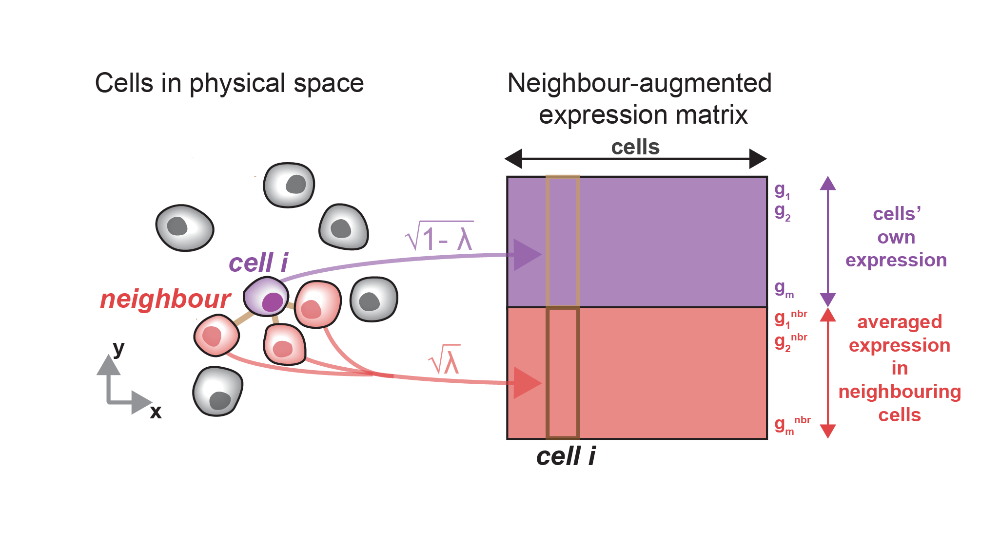

# BANKSY

## Neighbourhood Informed Clustering for Cell Type and Tissue Domain Annotation

### *Vipul Singhal\*, Nigel Chou\*, Joseph Lee, Jinyue Liu, Wan Kee Chock, Li Lin, YunChing Chang, Erica Teo, Hwee Kuan Lee, Kok Hao Chen<sup>#</sup> and Shyam Prabhakar<sup>#</sup>*

## Overview

BANKSY is a method for clustering spatial transcriptomic data by augmenting the transcriptomic profile of each cell with an average of the transcriptomes of its spatial neighbors. By incorporating neighborhood information for clustering, BANKSY is able to:

1. **improve cell-type assignment** in noisy data

2. distinguish **subtly different cell-types** stratified by microenvironment

3. **identify spatial zones** sharing the same microenvironment

BANKSY is applicable to a wide variety of spatial technologies (e.g. 10x Visium, Slide-seq, MERFISH) and scales well to large datasets. For more details on use-cases and methods, see the preprint. 

In this Python version of BANKSY which is compatible with Scanpy, we show how BANKSY can be used for task **1** (improving cell-type assignment) using Slide-seq and Slide-seq V2 mouse cerebellum datasets. This code base was used to generate figure 2 of the manuscript. The R version of BANKSY is available here (https://github.com/prabhakarlab/Banksy).

## Prerequisites <a name="prereqs"></a>

### System requirements: <a name="sysreqs"></a>

Machine with 16 GB of RAM. (All datasets tested required less than 16 GB). No non-standard hardware is required.

### Software requirements: <a name="softreqs"></a>

This software requires the following packages and has been tested on the following versions:

2.	Python 3.10.1
3.	Scanpy 1.8.2, Anndata 0.7.6
4.	numpy: 1.21.5
5.	scipy: 1.8.0
6.	umap: 0.5.2
7.	scikit-learn: 1.0.2
8.	python-igraph: 0.9.9

## License <a name="lic"></a>

This project is licensed under The GPLV3 license. See the [LICENSE.md](LICENSE.md) file for details


## Getting Started <a name="getstart"></a>

   
### Installation <a name="install"></a>

1.	Download and install [Anaconda](https://www.anaconda.com/distribution/#download-section).
2.	Create a new conda environment: [managing conda environments](https://docs.conda.io/projects/conda/en/latest/user-guide/tasks/manage-environments.html). 
3.	Use `conda install -c conda-forge scanpy python-igraph leidenalg` followed by `pip install scanpy`, as described in the [scanpy documentation](https://scanpy.readthedocs.io/en/stable/installation.html). This will install scanpy as well as other neccesary dependencies.
4.	Download BANKSY Python package.
5.	Run ipython notebooks: `slideseqv1_analysis.ipynb` and/or `slideseqv2_analysis.ipynb`. More details and description of different steps in the process are provided within the notebooks. Note that for Slide seq v2, you need to download the data from the [original source](https://singlecell.broadinstitute.org/single_cell/study/SCP948) and save it in the `data/slide_seq/v2` folder.


### General Steps of the BANKSY algorithm

1. **Preprocess** and **normalize** gene-cell matrix. This includes filtering out cells and genes by various criteria, and selecting the most highly variable genes or HVGs (for sequencing based spatial omics datasets e.g. 10X Visium and Slide-seq only). z-score by gene using `banksy.main.zscore` or `scanpy.pp.scale`.  Functions provided in the Scanpy package handle most of these steps. Parameters and filtering criterion may vary by spatial technology and dataset source.

2. Generate a **spatial graph** which defines spatial neighbour relationships using `banksy.main.generate_spatial_weights_fixed_nbrs`. This outputs a sparse adjacency matrix defining the graph. Visualize these with `utils.plotting.plot_graph_weights`.
   
   - `decay types`: `uniform` weights all neighbours equally, `reciprocal` weights neighbours by 1/r where r is the distance from neighbouring cell to the index cell. `ranked` ranks neighbouring cells by distance with farther cells having higher rank, then sets Gaussian decay by rank. Sum of neighbour weights are always normalized to 1 for each cell.
   - `generate_spatial_weights_fixed_radius` (not used in paper) generates a spatial graph where each cell is connected to all cells within a given radius. This leads to variable numbers of neighbours per cell.


3. Generate **neighbour expression matrix** (*n<sub>cells</sub>* by *n<sub>genes</sub>*) using spatial graph to average over spatial neighbours. The neighbour matrix can be computed simply by sparse matrix multiplication of the spatial graph's adjacency matrix with the gene-cell matrix.

4. Scale original expression matrix by *√(1 - λ)* and neighbour expression matrix by *√(λ)* and concatenate matrices to obtain **neighbour-augmented expression matrix** (*n<sub>cells</sub>* by *2n<sub>genes</sub>*) using `banksy.main.weighted_concatenate` with ```neighbourhood_contribution``` = λ. These operations are performed on the numerical data `adata.X`; use `banksy.main.bansky_matrix_to_adata` to recover Anndata object with the appropriate annotations.





*The following steps are identical to single cell RNA seq analysis:*

5. Use **PCA** to reduce expression matrix (either neighbour-augmented or original for comparison) to (*n<sub>cells</sub>* by *n<sub>PCA_dims</sub>*)
    
6. Find neighbours in expression space and **cluster** using graph-based clustering. Here we find expression-neighbours and perform Leiden clustering following the implemenation in Giotto.

### Other objects in package

* **`banksy.main.LeidenPartition`**   
Finds neighbours in expression space and performs Leiden clustering. Aims to replicate implementation from the Giotto package as of 2020 to align with R version of the code. Note that scanpy also has a [Leiden clustering implemenation](https://scanpy.readthedocs.io/en/stable/generated/scanpy.tl.leiden.html) with a different procedure for defining expression neighbours that can be used as an alternative. Note also that BANKSY is compatible with any clustering algorithm that takes a feature-cell matrix as input.

* **`labels.Label`**   
Object for convenient computation with class labels. Converts labels to sparse one-hot vector for fast computation of connectivity across clusters with spatial graph. To obtain an array of integer labels in the usual format (e.g. [1, 1, 5, 2, ...]), use `Label.dense`.

## Contributing

Bug reports, questions, request for enhancements or other contributions
can be raised at the [issue
page](https://github.com/prabhakarlab/Banksy_py/issues).

## Authors <a name="authors"></a>

* **Nigel Chou** (https://github.com/chousn)

## Acknowledgments <a name="ack"></a>

* **Vipul Singhal** - *developed R version of BANKSY, compatible with seurat* - (https://github.com/vipulsinghal02)

* **Joseph Lee** - *developed R version of BANKSY, compatible with seurat* - (https://github.com/jleechung)


